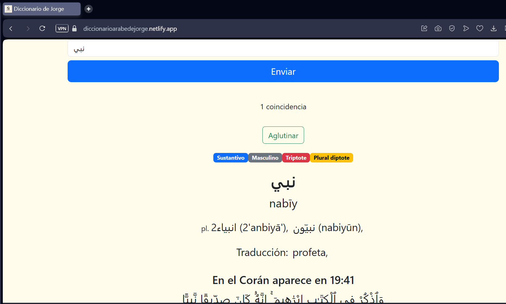

# Diccionario de Jorge

This project is a dictionary intented to help people learn the classical and quranic arabic language for spanish speakers.

The current repo consists of the front end section of the project. Other sections are backend (run by netlify lambdas) and database (hosted in an Atlas MongoDB cluster)

## How does it work

You can search a word in classical arabic or spanish just by selecting the right checkbox of the radiobutton.

This dictionary will show you the searched word being used in a verse of the Quran (if it appears), in a hadith (usually the 6 Classical Books but sometimes others) and being used in a real scenario (usually the classical and appraised fiqh book Al-Muhalla by Imam Ibn Hazm)

Tippical search looks like this:

### Search a word either in arabic or spanish

If a word you are looking for does not appear:

- Check your spelling
- Before looking it up, this dictionary app removes harakats, tanween and most of the quranic tajweed signs. Keep that in mind
- Shadda on semi-vowels like ي and و is usually not written on.
- Usually hamzas ء at the begining of a word and alif al wasl ٱ are written down as a simple alif ا

### You can save words for latter

One cool feature is that you can "agglutinate" words, that is, saving it at the bottom of the page so you can look the up multiples times even without internet conection.

Click on the AGLUTINAR button in order to save a word (this created a card with the word in arabic and its meaning). Then Tap or click on the header of the card in order to toggle the scrolling and collapsing of the card.

When you are done with a word just tap or click the X button on the card to delete it.

## Available Scripts

In the project directory, you can run:

### `npm start`

Runs the app in the development mode.\
Open [http://localhost:3000](http://localhost:3000) to view it in your browser.

The page will reload when you make changes.\
You may also see any lint errors in the console.

### `npm test`

Launches the test runner in the interactive watch mode.\
See the section about [running tests](https://facebook.github.io/create-react-app/docs/running-tests) for more information.

### `npm run build`

Builds the app for production to the `build` folder.\
It correctly bundles React in production mode and optimizes the build for the best performance.

The build is minified and the filenames include the hashes.\
Your app is ready to be deployed!

See the section about [deployment](https://facebook.github.io/create-react-app/docs/deployment) for more information.
